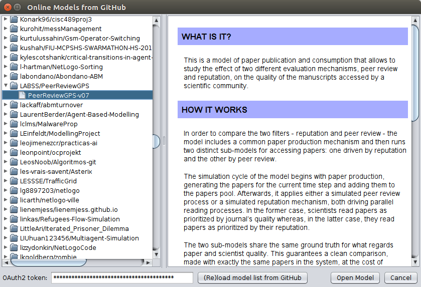

# The NetLogo Online Models Dialog

This is the repository for a tool that I'm developing to show NetLogo models hosted on GitHub from within NetLogo.

I will eventually turn the tool into a proper NetLogo plugin and hosted here, but it is currently being developed inside a fork of NetLogo at https://github.com/nicolaspayette/NetLogo/tree/online-models.

To try it, from a bash terminal:

```
git clone -b online-models https://github.com/nicolaspayette/NetLogo.git
cd NetLogo
git submodule update --init
./sbt netlogo/run
```

I gave a talk about this at [SSC2018](http://ssc2018.dsv.su.se/). Here are:

- [The slides](documents/ssc2018/slides/ssc2018-online-models-slides.pdf)
- [The paper](documents/ssc2018/paper/payette.pdf)

Here is what the dialog looks like:


